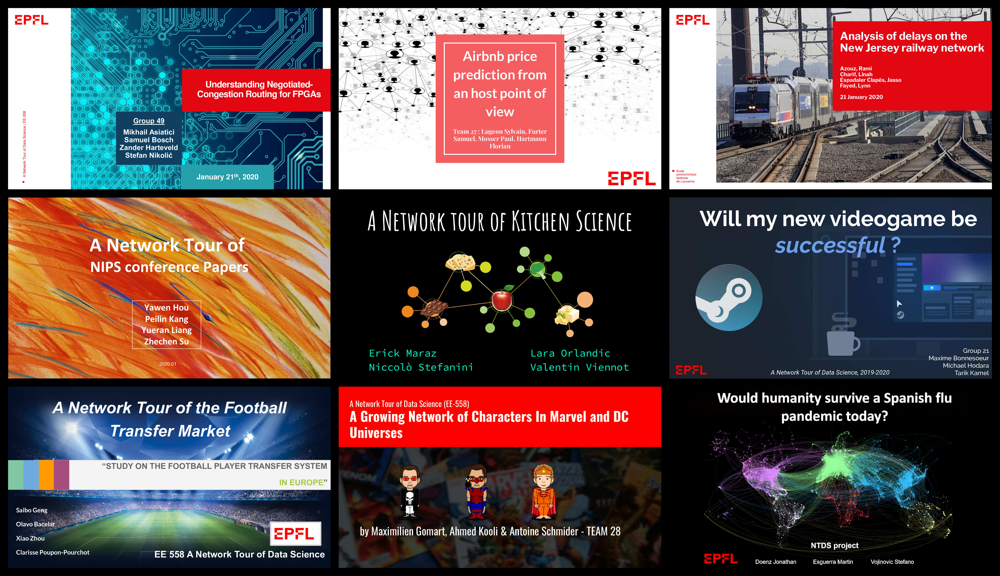

# A Network Tour of Data Science, edition 2019

[][binder]

[binder]: https://mybinder.org/v2/gh/mdeff/ntds_2019/outputs?urlpath=lab

This repository contains the material for the practical work associated with the EPFL master course [EE-558 A Network Tour of Data Science][epfl] ([moodle]), taught in fall 2019.
The course is divided in two parts: **Network Science** and **Learning with Graphs**.
The material revolves around the following topics:
[Network Science](https://en.wikipedia.org/wiki/Network_science),
[Spectral Graph Theory](https://en.wikipedia.org/wiki/Spectral_graph_theory),
[Graph Signal Processing](https://arxiv.org/abs/1211.0053),
[Data Science](https://en.wikipedia.org/wiki/Data_science),
[Machine Learning](https://en.wikipedia.org/wiki/Machine_learning).

Theoretical knowledge is taught during lectures.
Practical knowledge is taught through [tutorials](#tutorials).
Both are practiced and evaluated through [two assignments](#assignments) and a [semester project](#projects).
Below are slides about the organization of the course.

1. [Course organization][practical_info]
1. [Projects][projects]
1. Concluding remarks

The content is similar to the [2017] and [2018] editions, with more emphasis on machine learning with graphs.
Compared to the [2016 edition], the course has been refocused on graph and network sciences.

[epfl]: https://edu.epfl.ch/coursebook/en/a-network-tour-of-data-science-EE-558
[moodle]: https://moodle.epfl.ch/course/view.php?id=15299
[2016 edition]: https://github.com/mdeff/ntds_2016
[2017]: https://github.com/mdeff/ntds_2017
[2018]: https://github.com/mdeff/ntds_2018

[practical_info]: https://github.com/mdeff/ntds_2019/blob/outputs/slides/ntds_info.pdf
[projects]: https://github.com/mdeff/ntds_2019/blob/outputs/slides/ntds_projects.pdf

## Tutorials

Below is the teaching material you'll find in this repository (tentative).

1. [Installation instructions](#installation)
1. [Introduction][t01]
1. [Building graphs from edge lists][t02]
1. [Building graphs from features][t03]
1. [Manipulating graphs with NetworkX][t04]
1. [Machine learning with scikit-learn][t05]
1. [Interactive graph visualization with gephi][t06]
1. [Graph signal processing with pygsp][t07]

[t01]: https://nbviewer.jupyter.org/github/mdeff/ntds_2019/blob/outputs/tutorials/01_introduction.ipynb
[t02]: https://nbviewer.jupyter.org/github/mdeff/ntds_2019/blob/outputs/tutorials/02_graph_from_edge_list.ipynb
[t03]: https://nbviewer.jupyter.org/github/mdeff/ntds_2019/blob/outputs/tutorials/03_graph_from_features.ipynb
[t04]: https://nbviewer.jupyter.org/github/mdeff/ntds_2019/blob/outputs/tutorials/04_networkx.ipynb
[t05]: https://nbviewer.jupyter.org/github/mdeff/ntds_2019/blob/outputs/tutorials/05_scikit_learn.ipynb
[t06]: tutorials/06_visualization
[t07]: https://nbviewer.jupyter.org/github/mdeff/ntds_2019/blob/outputs/tutorials/07_pygsp.ipynb

For this course, you'll use the following tools:
[conda] & [anaconda], [python], [jupyter], [git], [numpy], [scipy], [matplotlib], [pandas], [networkx], [graph-tool], [pygsp], [gephi], [scikit-learn], [pytorch].

[conda]: https://conda.io
[anaconda]: https://anaconda.org
[python]: https://www.python.org
[jupyter]: https://jupyter.org
[git]: https://git-scm.com
[numpy]: https://www.numpy.org
[scipy]: https://www.scipy.org
[matplotlib]: https://matplotlib.org
[pandas]: https://pandas.pydata.org
[networkx]: https://networkx.github.io
[graph-tool]: https://graph-tool.skewed.de
[pygsp]: https://pygsp.readthedocs.io
[gephi]: https://gephi.org
[scikit-learn]: https://scikit-learn.org
[pytorch]: https://pytorch.org

## Assignments

The following assignments were designed to evaluate the theoretical understanding of students through practice.
As a Data Science course, those activities are realized on real data and networks.

1. Network science: [assignment][a1q], [solution][a1s].
1. Learning with graphs: [assignment][a2q], [solution][a2s], [feedback][a2f].

[a1q]: https://nbviewer.jupyter.org/github/mdeff/ntds_2019/blob/outputs/assignments/1_network_science.ipynb
[a1s]: https://nbviewer.jupyter.org/github/mdeff/ntds_2019/blob/outputs/assignments/1_network_science_solution.ipynb
[a2q]: https://nbviewer.jupyter.org/github/mdeff/ntds_2019/blob/outputs/assignments/2_learning_with_graphs.ipynb
[a2s]: https://nbviewer.jupyter.org/github/mdeff/ntds_2019/blob/outputs/assignments/2_learning_with_graphs_solution.ipynb
[a2f]: https://nbviewer.jupyter.org/github/mdeff/ntds_2019/blob/outputs/assignments/2_learning_with_graphs_feedback.ipynb

## Projects

Part of the course is evaluated by an open-ended project (see the [description][projects]), proposed and carried out by groups of four students.
We provide a list of [datasets and project ideas](projects).
Students review each other's work to receive intermediate feedback and internalize the [grading criteria](projects/grading.md).
Those data projects are meant to jointly practice and evaluate their theoretical network analysis skills and practical Data Science skills.
Below is the work of the 137 students enrolled that year.

* [[proposal][p01], [report][r01], [slides][s01], [code][c01]] Guessing Students Gender by their Course Plan
* [[proposal][p02], [report][r02], [slides][s02], [code][c02]] Wikipedia Query Engine
* [[proposal][p03], [report][r03], [slides][s03], [code][c03]] Would humanity survive a Spanish flu pandemic today?
* [[proposal][p04], [report][r04], [slides][s04], [code][c04]] Detection of Spammers in a Social Network
* [[proposal][p05], [report][r05], [slides][s05], [code][c05]] Will this Movie be Successful? A network based prediction of Award nomination
* [[proposal][p06], [report][r06], [slides][s06], [code][c06]] Movinder: A Movie Recommendation System for Groups
* [[proposal][p07], [report][r07], [slides][s07], [code][c07]] Movie Recommendation Using Graph Neural Networks
* [[proposal][p08], [report][r08], [slides][s08], [code][c08]] Actors Tour of Data Science
* [[proposal][p09], [report][r09], [slides][s09], [code][c09]] Aggregation Phenomena in Movie Industry
* [[proposal][p10], [report][r10], [slides][s10], [code][c10]] An exploration of recipes
* [[proposal][p11], [report][r11], [slides][s11], [code][c11]] A dive into the music industry
* [[proposal][p12], [report][r12], [slides][s12], [code][c12]] A network-based recommendation system
* [[proposal][p13], [report][r13], [slides][s13], [code][c13]] Science and Religion
* [[proposal][p14], [report][r14], [slides][s14], [code][c14]] A Power Tour of Data Science
* [[proposal][p15], [report][r15], [slides][s15], [code][c15]] Movie Recommender Exploration
* [[proposal][p16], [report][r16], [slides][s16], [code][c16]] Movie Recommendation System
* [[proposal][p17], [report][r17], [slides][s17], [code][c17]] A Hybrid Matrix Factorization via Graph Signal Processing
* [[proposal][p18], [report][r18], [slides][s18], [code][c18]] A Network Approach to Genetic and Expression based Phenotype Prediction on Mouse
* [[proposal][p19], [report][r19], [slides][s19], [code][c19]] Discovering Communities in Global Flight Route Graph
* [[proposal][p20], [report][r20], [slides][s20], [code][c20]] Strategic Recipes
* [[proposal][p21], [report][r21], [slides][s21], [code][c21]] Will my new videogame be successful?
* [[proposal][p22], [report][r22], [slides][s22], [code][c22]] A Network Tour of Inter-County Migration in the United States
* [[proposal][p23], [report][r23], [slides][s23], [code][c23]] A Network Tour of the Football Transfer Market
* [[proposal][p24], [report][r24], [slides][s24], [code][c24]] Analysis of delays on the New Jersey railway network
* [[proposal][p25], [report][r25], [slides][s25], [code][c25]] A Network Tour of Kitchen Science: Ingredient Recommendation and Replacement
* [[proposal][p26], [report][r26], [slides][s26], [code][c26]] A Network Tour of NIPS Conference Papers
* [[proposal][p27], [report][r27], [slides][s27], [code][c27]] Airbnb price prediction from an host point of view
* [[proposal][p28], [report][r28], [slides][s28], [code][c28]] A Growing Network of Characters in Marvel and DC Universes
* [[proposal][p29], [report][r29], [slides][s29], [code][c29]] Movie Recommendations using Signal Diffusion
* [[proposal][p30], [report][r30], [slides][s30], [code][c30]] Genetically Determined Susceptibility to Malaria
* [[proposal][p32], [report][r32], [slides][s32], [code][c32]] Twitter for publication success? A computational investigation
* [[proposal][p33], [report][r33], [slides][s33], [code][c33]] Graph-based Recommender System
* [[proposal][p35], [report][r35], [slides][s35], [code][c35]] A Network Tour of Cooking
* [[proposal][p36], [report][r36], [slides][s36], [code][c36]] A Culinary Tour of Data Science
* [[proposal][p49], [report][r49], [slides][s49], [code][c49]] Understanding Negotiated-Congestion Routing for FPGAs

As each team stored their code in a github repository, all their code can conveniently be downloaded with `git clone --recurse-submodules https://github.com/mdeff/ntds_2019`.
One folder per team will be populated in `projects/code`.

[p01]: projects/proposals/team_01.pdf
[p02]: projects/proposals/team_02.pdf
[p03]: projects/proposals/team_03.pdf
[p04]: projects/proposals/team_04.pdf
[p05]: projects/proposals/team_05.pdf
[p06]: projects/proposals/team_06.pdf
[p07]: projects/proposals/team_07.pdf
[p08]: projects/proposals/team_08.pdf
[p09]: projects/proposals/team_09.pdf
[p10]: projects/proposals/team_10.pdf
[p11]: projects/proposals/team_11.pdf
[p12]: projects/proposals/team_12.pdf
[p13]: projects/proposals/team_13.pdf
[p14]: projects/proposals/team_14.pdf
[p15]: projects/proposals/team_15.pdf
[p16]: projects/proposals/team_16.pdf
[p17]: projects/proposals/team_17.pdf
[p18]: projects/proposals/team_18.pdf
[p19]: projects/proposals/team_19.pdf
[p20]: projects/proposals/team_20.pdf
[p21]: projects/proposals/team_21.pdf
[p22]: projects/proposals/team_22.pdf
[p23]: projects/proposals/team_23.pdf
[p24]: projects/proposals/team_24.pdf
[p25]: projects/proposals/team_25.pdf
[p26]: projects/proposals/team_26.pdf
[p27]: projects/proposals/team_27.pdf
[p28]: projects/proposals/team_28.pdf
[p29]: projects/proposals/team_29.pdf
[p30]: projects/proposals/team_30.pdf
[p32]: projects/proposals/team_32.pdf
[p33]: projects/proposals/team_33.pdf
[p35]: projects/proposals/team_35.pdf
[p36]: projects/proposals/team_36.pdf
[p49]: projects/proposals/team_49.pdf

[r01]: projects/reports/team_01.pdf
[r02]: projects/reports/team_02.pdf
[r03]: projects/reports/team_03.pdf
[r04]: projects/reports/team_04.pdf
[r05]: projects/reports/team_05.pdf
[r06]: projects/reports/team_06.pdf
[r07]: projects/reports/team_07.pdf
[r08]: projects/reports/team_08.pdf
[r09]: projects/reports/team_09.pdf
[r10]: projects/reports/team_10.pdf
[r11]: projects/reports/team_11.pdf
[r12]: projects/reports/team_12.pdf
[r13]: projects/reports/team_13.pdf
[r14]: projects/reports/team_14.pdf
[r15]: projects/reports/team_15.pdf
[r16]: projects/reports/team_16.pdf
[r17]: projects/reports/team_17.pdf
[r18]: projects/reports/team_18.pdf
[r19]: projects/reports/team_19.pdf
[r20]: projects/reports/team_20.pdf
[r21]: projects/reports/team_21.pdf
[r22]: projects/reports/team_22.pdf
[r23]: projects/reports/team_23.pdf
[r24]: projects/reports/team_24.pdf
[r25]: projects/reports/team_25.pdf
[r26]: projects/reports/team_26.pdf
[r27]: projects/reports/team_27.pdf
[r28]: projects/reports/team_28.pdf
[r29]: projects/reports/team_29.pdf
[r30]: projects/reports/team_30.pdf
[r32]: projects/reports/team_32.pdf
[r33]: projects/reports/team_33.pdf
[r35]: projects/reports/team_35.pdf
[r36]: projects/reports/team_36.pdf
[r49]: projects/reports/team_49.pdf

[s01]: projects/slides/team_01.pdf
[s02]: projects/slides/team_02.pdf
[s03]: projects/slides/team_03.pdf
[s04]: projects/slides/team_04.pdf
[s05]: projects/slides/team_05.pdf
[s06]: projects/slides/team_06.pdf
[s07]: projects/slides/team_07.pdf
[s08]: projects/slides/team_08.pdf
[s09]: projects/slides/team_09.pdf
[s10]: projects/slides/team_10.pdf
[s11]: projects/slides/team_11.pdf
[s12]: projects/slides/team_12.pdf
[s13]: projects/slides/team_13.pdf
[s14]: projects/slides/team_14.pdf
[s15]: projects/slides/team_15.pdf
[s16]: projects/slides/team_16.pdf
[s17]: projects/slides/team_17.pdf
[s18]: projects/slides/team_18.pdf
[s19]: projects/slides/team_19.pdf
[s20]: projects/slides/team_20.pdf
[s21]: projects/slides/team_21.pdf
[s22]: projects/slides/team_22.pdf
[s23]: projects/slides/team_23.pdf
[s24]: projects/slides/team_24.pdf
[s25]: projects/slides/team_25.pdf
[s26]: projects/slides/team_26.pdf
[s27]: projects/slides/team_27.pdf
[s28]: projects/slides/team_28.pdf
[s29]: projects/slides/team_29.pdf
[s30]: projects/slides/team_30.pdf
[s32]: projects/slides/team_32.pdf
[s33]: projects/slides/team_33.pdf
[s35]: projects/slides/team_35.pdf
[s36]: projects/slides/team_36.pdf
[s49]: projects/slides/team_49.pdf

[c01]: https://github.com/jm-x-1/NTDS_2019_PROJECT_TEAM_1
[c02]: https://github.com/FredBaos/Ntds_project_team02
[c03]: https://github.com/jonathan-doenz/spanish_flu_on_airports
[c04]: https://github.com/alielabridi/NTDS_2019
[c05]: https://github.com/carparel/NTDS
[c06]: https://github.com/Movinder/movielens-imdb-exploration
[c07]: https://github.com/dinotuku/ntds-2019-project-team-7
[c08]: https://github.com/eliasmpw/EE-558-ntds/tree/master/projects/project_ntds_2019
[c09]: https://github.com/EPFLEXCLT/NTDS2019_team9
[c10]: https://github.com/alex-mocanu/A-Network-Tour-of-DS-Homework/tree/master/Project
[c11]: https://github.com/SachaLeblanc/NTDS_final
[c12]: https://github.com/Lambo97/MovieRecommendation
[c13]: https://github.com/aaag97/ntds-projects
[c14]: https://github.com/TheUser0571/NTDS_assignments/tree/master/Project
[c15]: https://github.com/arthurbabey/DeepMovieRecommender
[c16]: https://github.com/aurkinet/Group-16
[c17]: https://github.com/blagojce95/ntds_project
[c18]: https://github.com/raphaelreis/Network_tour_of_mice_genetics
[c19]: https://github.com/lchenbb/NTDS2019_Project
[c20]: https://github.com/raphstrebel/ntds_project
[c21]: https://github.com/michaelhodara/ntds_2019_team21
[c22]: https://github.com/zxyzz/ntds_project
[c23]: https://github.com/Saibo-creator/ntds_project
[c24]: https://github.com/linahcharif/NTDS-Team24
[c25]: https://github.com/misterw97/ntds_kitchen_science
[c26]: https://github.com/sting1000/ntds_project
[c27]: https://github.com/sfurter/Project_NTDS_Group_27
[c28]: https://github.com/ahmedkooli/ntds_comics
[c29]: https://github.com/jlabhard/ntds_project_movielens
[c30]: https://github.com/arturs68/ntds-genetic-malaria-susceptibility
[c32]: https://github.com/albornet/ntds_2019_team_32
[c33]: https://github.com/YuxuanLongBeyond/Graph-based-Recommendation-System
[c35]: https://github.com/gaumuel/ntds2019_project
[c36]: https://github.com/Davit98/NTDS-Project
[c49]: https://github.com/m-asiatici/ntds-2019-team-49-fpga

## Installation

Click the [binder badge][binder] to play with the notebooks from your browser without installing anything.

Another option is to use the EPFL's JupyterHub service, available at <https://noto.epfl.ch>.
While the default environment has most packages pre-installed, you can create different environments (e.g., for different classes).
To do so, follow the instructions contained in the notebooks supplied in the `Documentation` folder that is available on your Noto instance.

For a local installation, you will need [git], [Python], and packages from the [Python scientific stack][scipy].
If you don't know how to install those on your platform, we recommend to install [Miniconda] or [Anaconda], a distribution of the [conda] package and environment manager.
Follow the below instructions to install it and create an environment for the course.

1. Download the Python 3.x installer for Windows, macOS, or Linux from <https://conda.io/miniconda.html> and install with default settings.
   Skip this step if you have conda already installed (from [Miniconda] or [Anaconda]).
   * Windows: double-click on `Miniconda3-latest-Windows-x86_64.exe`.
   * macOS: double-click on `Miniconda3-latest-MacOSX-x86_64.pkg` or run `bash Miniconda3-latest-MacOSX-x86_64.sh` in a terminal.
   * Linux: run `bash Miniconda3-latest-Linux-x86_64.sh` in a terminal or use your package manager.
1. Open a terminal.
   Windows: open the Anaconda Prompt from the Start menu.
1. Install git with `conda install git`.
1. Navigate to the folder where you want to store the course material with `cd path/to/folder`.
1. Download this repository with `git clone https://github.com/mdeff/ntds_2019`.
1. Enter the repository with `cd ntds_2019`.
1. Create an environment with the packages required for the course with `conda env create -f environment.yml`.
1. Run the steps below to start Jupyter. You should be able to run the [`test_install.ipynb`][test_install] notebook.

[test_install]: https://nbviewer.jupyter.org/github/mdeff/ntds_2019/blob/outputs/test_install.ipynb

Every time you want to work, do the following:

1. Open a terminal.
   Windows: open the Anaconda Prompt from the Start menu.
1. Activate the environment with `conda activate ntds_2019`.
1. Navigate to the folder where you stored the course material with `cd path/to/folder/ntds_2019`.
1. Start Jupyter with `jupyter lab`.
   The command should open a new tab in your web browser.
1. Edit and run the notebooks from your browser.
1. Once done, you can run `conda deactivate` to leave the `ntds_2019` environment.

[git]: https://git-scm.com
[python]: https://www.python.org
[scipy]: https://www.scipy.org
[anaconda]: https://www.anaconda.com/download
[miniconda]: https://conda.io/miniconda.html
[conda]: https://conda.io
[conda-forge]: https://conda-forge.org

## Team

* Lecturers:
[Pierre Vandergheynst](https://people.epfl.ch/pierre.vandergheynst),
[Pascal Frossard](https://people.epfl.ch/pascal.frossard),
[Andreas Loukas](https://andreasloukas.blog),
[Michaël Defferrard](https://deff.ch),
[Volodymyr Miz](http://miz.space).
* Assistants:
[Michaël Defferrard](https://deff.ch),
[Volodymyr Miz](http://miz.space),
[Effrosyni Simou](https://people.epfl.ch/effrosyni.simou),
[Eda Bayram](https://people.epfl.ch/eda.bayram),
[Benjamin Ricaud](https://github.com/bricaud),
[Nicolas Aspert](https://people.epfl.ch/nicolas.aspert),
[Clément Vignac](https://people.epfl.ch/clement.vignac),
[Guillermo Jiménez](https://gortizji.github.io),
[Nikolaos Karalias](https://people.epfl.ch/nikolaos.karalias).

## License

The content is released under the terms of the [MIT License](LICENSE.txt).
