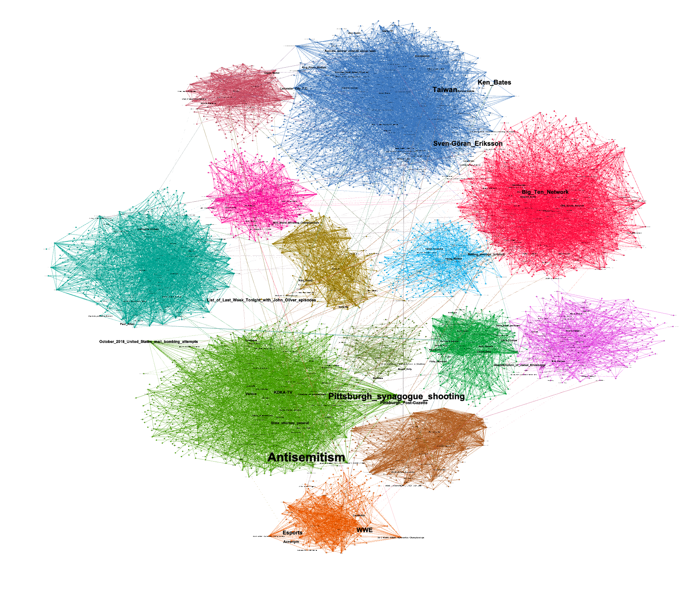

# [NTDS'19] tutorial 6: graph visualization with gephi
[ntds'19]: https://github.com/mdeff/ntds_2019

[Volodymyr Miz](http://miz.space), [EPFL LTS2](https://lts2.epfl.ch).

## Tutorials

1. [Layouts, attributes, and graph exploration.](layout)
2. [Publish an interactive visualization of your graph.](publish)

