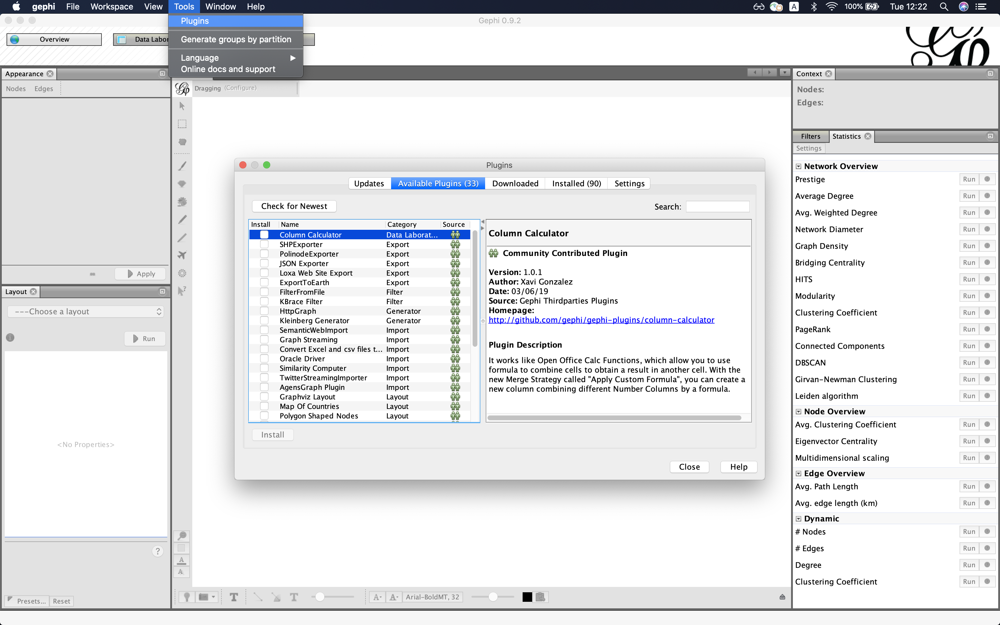
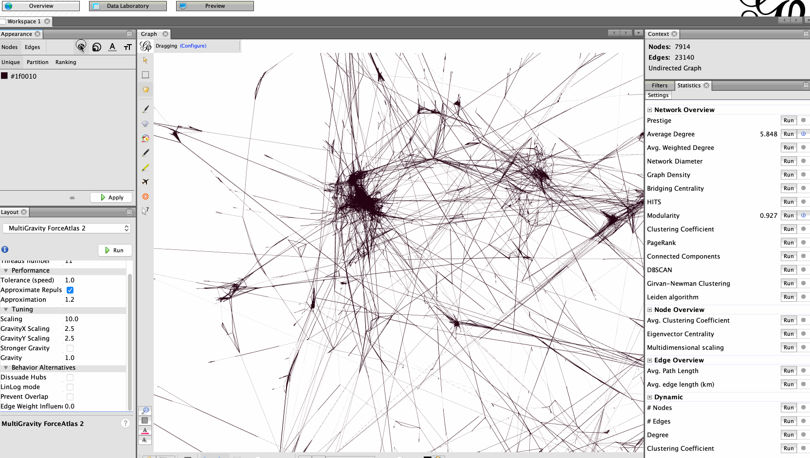
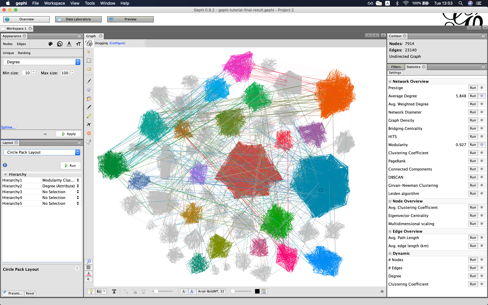

# [NTDS'19] tutorial 6: graph visualization with gephi
[ntds'19]: https://github.com/mdeff/ntds_2019

[Volodymyr Miz](http://miz.space), [EPFL LTS2](https://lts2.epfl.ch).

## Part 2: Publish an interactive visualization of your graph

In this tutorial we will learn:
 * How to prepare a graph layout before publishing it online.
 * How to export a [SigmaJS](http://sigmajs.org) template and customize it.
 * How to publish your interactive graph visualization online using GitHub pages.

Watch a short walk-through screencast to get an idea of what we are going to do.
(The video has sound.)

### 1. Install plugins

Install the following plugins before starting this tutorial (unless they are already installed):
* Multigravity Force Atlas 2
* Circle Pack
* Label Adjust
* SigmaJS exporter.

### 2. Import graph

Open the GEXF file in Gephi (`File->Open...`).
You can find  it in this folder.
In this example, we are going to work with a subsample of English Wikipedia.
The graph contains pages that had anomalous visitor activity over the period 16-31 August 2018.

### 3. Layout

Let's start with the **Multigravity Force Atlas 2**.
Take a look at [the first tutorial](../layout) if you want to use another layout.

Parameters:
* Scaling: 10
* Edge Weight Influence: 0
* Dissuade hubs: True

### 4. Export SigmaJS template

Export the **SigmaJS template** with `File->Export->SigmaJS template` and fill in all required fields.

### 5. Test locally

Go to the exported folder and start a simple Python HTTP server to test your visualization.
Type `python -m http.server` in your terminal (or `python -m SimpleHTTPServer` for python 2.7).

Now, you can interact with your graph using your web browser (works best in Chrome).
Go to <http://localhost:8000/> and play with it.

That is all we need to do to publish our visualization online. Although, as we can see, the graph looks quite raw and it is hard to interact with it. Let's compute more attributes and make the graph look nicer and more user-friendly.

### 6. Compute attributes

We are going to use attributed layouts to enhance readability. Before doing that, we need to compute attributes.

* Modularity (Use weights: `False`)
* Average Degree

### 7. Color nodes according to their community

Color nodes according to their modularity class and make their size correspond to their degree.

### 8. Circle Pack layout

Use **Circle Pack layout** to rearrange nodes according to attributes. Use *modularity* and *degree* as parameters.

### 9. Scale and labels

Adjust the scale and labels. Use **Expansion layout** to increase the scale of the layout. Display labels, reduce the font size and use **Label Adjust layout** to prevent overlapping node labels.

### 10. Export SigmaJS template once again and test it locally

Our graph looks more readable now and it's much easier to interact with it. Export SigmaJS template once again and check it on localhost (steps 4 and 5).

### 11. Publish your graph on GitHub pages

Now, we can publish everything to GitHub pages.
* Create a GitHub repository.
* Go to the **settings** of your repository and find **GitHub pages** section. Specify `master branch` as a source.
* Clone the repository.
* Copy the exported SigmaJS template that we have prepared to the cloned folder.
* Push the files to the repository.
* Check the website with your interactive visualization (<https://[YOUR-GITHUB-USER-NAME].github.io/[VIS-REPOSITORY-NAME]/network/>)
    * Et voila. You have just published your interactive graph visualization online.

### 12. Play with the config file (optional)

You can adjust properties of the visualization using the config file that you can find in the folder with our SigmaJS template. Play with SigmaJS config file:
* Adjust node sizes.
* Adjust label thresholds.

### 13. Customize the HTML/CSS (optional)

If you are familiar with HTML/CSS, you can customize the style of the web page.
